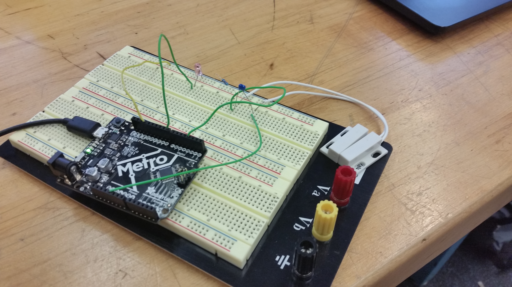
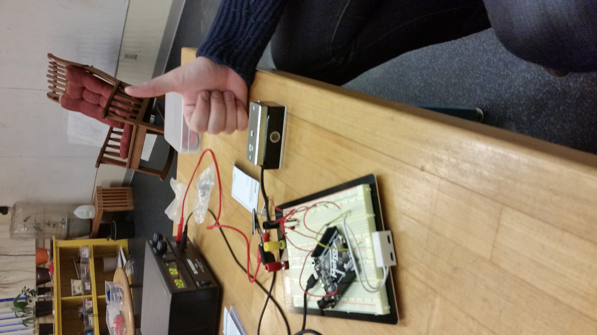

# P00: Stuffer Stopper

**Author(s)**: *Rusty Dotson, Hayes Clark*

**Google Document**: *https://docs.google.com/document/d/1Yr8ZmxMphmbY5k99sDViwSRO1JFI8glimYSl_ks4h9w/edit?usp=sharing*

---
## Purpose
The problem that we are trying to solve is over-eating and/or wasting energy, by locking users out of their refrigerator. Leaving the fridge door open for too long wastes energy and leaving the door open is a bad habit. Also, opening the fridge to grab snacks multiple times could also lead to weight problems that could easily be stopped. We will have a sensor to check how many times and how long a refrigerator is opened and lock the door after a specific amount of time.

## Initial Design Plan
Physical Components:
- refridgerator, the primary subject
- electronic lock, locks the door when opened too many times and too long
- door sensor, checks when the door is opened
- Arduino, used to program the locking mechanism
- capacitor, prevent misreads on the door sensor
- resistor, used to create a voltage divider
- LED, used as an example of a door lock

Coding Components
- timer
- code that sets the door to lock
- checker to see how many times the door opens

## Instructions

**Images**:

## Files
images            - a folder which will contain images of the project hardware.

LICENSE           - It's the license that allows certain software usage for the project.

README.md         - the README.md is this document which will be used to help users understand what our product does.

example-README.md - an example to help developers create the README.md file.

hardware_prototype/hardware_prototype.ino - The program used for the arduino to use the lock based on the number of opens.
